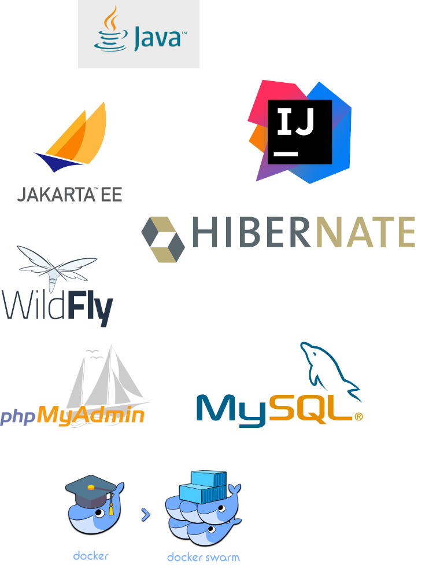

# Exercises vulenaribilty java - jakarta EE

Used technologies

Needed Software:

IDE:  IntelliJ V2022.2
Docker: podman / docker 
JDK: 17 (any openJDK)
Wildfly: 26.1.2

### Installing Wildfly
    download distribution https://www.wildfly.org/downloads/
	unzip into /sqli-java/wildfly

create management console user for verify datasource

    pwd -> wildfly/bin

add admin user to access / verify over management console (user / password)

    add-user.bat admin admin
    
    http://127.0.0.1:9990/console

start service

    sqli-java/wildfly/bin/standalone.bat

open jboss-cli 

    jboss-cli -c

within jboss-cli add jdbcdriver module **(replace driver resource with your own path)**

    module add --name=com.mysql.driver8  --dependencies=javax.api,javax.transaction.api --resources=C:\git\sqli-java\db\mysql\mysql-connector-java-8.0.30.jar

restart wildfly -> open jobss-cli and create driver

    jboss-cli -c
    /subsystem=datasources/jdbc-driver=mysql/:add(driver-module-name=com.mysql.driver8,driver-name=mysql,driver-class-name=com.mysql.jdbc.Driver)

Wildfly admin console ui allows to verify installation:

create datasource -> **password & target mysql service ist passed here**

    data-source add --jndi-name=java:/MySqli --name=MySqlPool --connection-url=jdbc:mysql://localhost:3307/jakartajdbc --driver-name=mysql --user-name=jakartaUser --password=jakartaPassword
    data-source add --jndi-name=java:/MySqliJpa --name=MySqlPool2 --connection-url=jdbc:mysql://localhost:3307/jakartajpa --driver-name=mysql --user-name=jakartaUser --password=jakartaPassword
    data-source add --jndi-name=java:/MySqliJpaUsers --name=MySqlPool3 --connection-url=jdbc:mysql://localhost:3307/jakartaauth --driver-name=mysql --user-name=jakartaUser --password=jakartaPassword

leave jboss-cli

### Installing mysql container

see configuration of mysql service  myphpAdmin in mysql_stack.yml

    cd /sqli-java/db
    docker network create -d overlay --attachable sqli-network
    docker stack deploy -c mysql_stack.yml sqldeploy

MySql port is exposed over localhost:3307, the phpMyAdmin GUI for MySql Db is reachable over [localhost:8085](http://localhost:8085)
user password can be extracted from /db/mysql_stack.yml

The db will be automatically setup with the init.sql script and should look like this:

### orm config

src/main/resources/META-INF/perstistence.xml

    <persistence xmlns="http://xmlns.jcp.org/xml/ns/persistence"
             xmlns:xsi="http://www.w3.org/2001/XMLSchema-instance"
             xsi:schemaLocation="http://xmlns.jcp.org/xml/ns/persistence
    http://xmlns.jcp.org/xml/ns/persistence/persistence_2_1.xsd"
             version="2.1" >
        <persistence-unit name="jakartaJpa" transaction-type="JTA">
            <jta-data-source>java:/MySqliJpa</jta-data-source>
            <validation-mode>CALLBACK</validation-mode>
            <properties>
                <property name="jakarta.persistence.schema-generation.database.action" value="drop-and-create"/>
                <!--property name="hibernate.dialect" value="org.hibernate.dialect.HSQLDialect"/>
                <property name="hibernate.hbm2ddl.auto" value="create-drop"/-->
            </properties>
        </persistence-unit>
    </persistence>

### setup wilfly run config in intellij

### Sources of instruction and setup:

wildfly: https://reachmnadeem.wordpress.com/2021/05/13/install-and-configure-mysql-jdbc-driver-on-jboss-wildfly/
mysql image: > https://towardsdatascience.com/how-to-run-mysql-and-phpmyadmin-using-docker-17dfe107eab7
JEE: https://www.digitalocean.com/community/tutorials/java-datasource-jdbc-datasource-example#jdbc-datasource
JPA-CriteriaBuilder: https://www.baeldung.com/hibernate-criteria-queries log SQL statements: https://vladmihalcea.com/the-best-way-to-log-jdbc-statements/ 
database migration: https://vladmihalcea.com/flyway-database-schema-migrations/