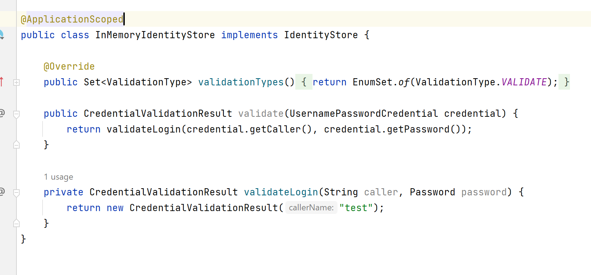
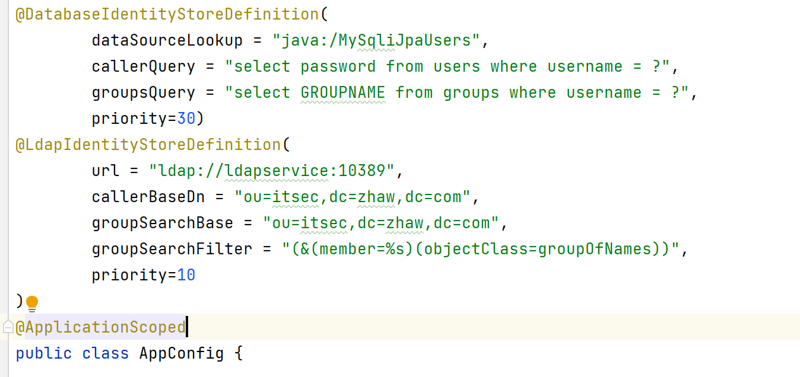
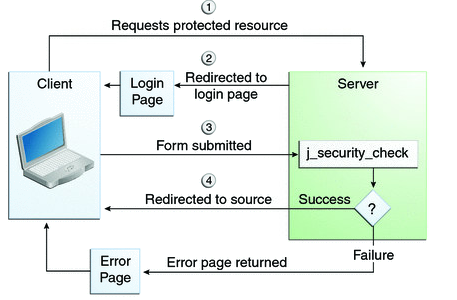
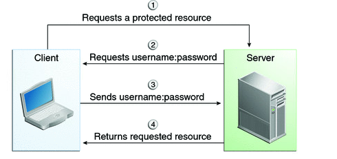
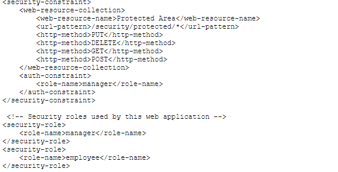

Setup Authentication / Authorization

The concept is splitted in differen parts:

- Authentication
- Authorization
- Identity Provider

All three types can be configured as single service.

### IdentityProvider

To provide indentities one can use the webapplication server to provide that context (in several different ways: WilfFly_Elytron_Secirty https://docs.wildfly.org/26/WildFly_Elytron_Security.html)

There is also the possibility to define within the application which identity provider should be used: (within LDAP config is already another security isssue(ldap protocol not ldaps), ready from database looks like password is saved cleartext(can be configured within authentication setup))

### Authentication (JEE specification)

## Authorization
Deployment descriptor (can have webapp server depending details web.xml)

