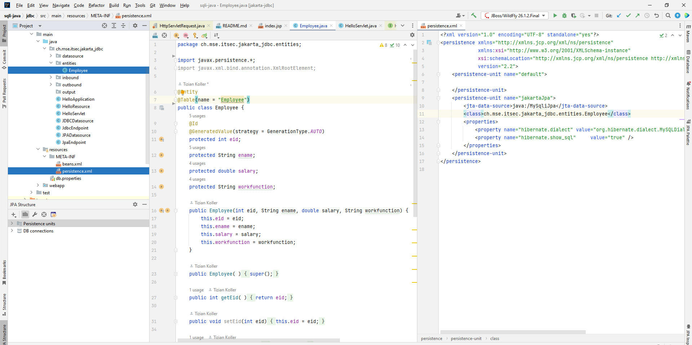

## Jakarta EE overview (prior 2019: Java EE)

### What language?
Jakarata EE is in Java. Last version is Java 19.

### MVC?
JEE do not require a particular design pattern/architecture but MVC is of course recommended.

Controller --> Servlet (Java classes which handle requests from the client and send a response)

Model --> Java Beans (Java classes)

View --> JSP (HTML pages)

Some MVC frameworks: JSF, Spring, Hibernate.

### DB connection / object setup

concept

Entity class setup

configuration within wildfly admin console:

wildfly setup of datasource: (wildfly/standalone/configuration/standalone.xml)

               <datasources>
                <datasource jndi-name="java:/MySqli" pool-name="MySqlPool">
                    <connection-url>jdbc:mysql://localhost:3307/jakartajdbc</connection-url>
                    <driver>mysql</driver>
                    <security>
                        <user-name>jakartaUser</user-name>
                        <password>jakartaPassword</password>
                    </security>
                </datasource>
                <datasource jndi-name="java:/MySqliJpa" pool-name="MySqlPool2">
                    <connection-url>jdbc:mysql://localhost:3307/jakartajpa</connection-url>
                    <driver>mysql</driver>
                    <security>
                        <user-name>jakartaUser</user-name>
                        <password>jakartaPassword</password>
                    </security>
                </datasource>
                <drivers>
                    <driver name="mysql" module="com.mysql.driver8">
                        <driver-class>com.mysql.jdbc.Driver</driver-class>
                    </driver>
                </drivers>
            </datasources>

### update model & data
existing properties on the hibernate framework can autogenerate the db schema. but incremental updates are not possible. therefor exists the framework Flyway
how to setup and use: https://vladmihalcea.com/flyway-database-schema-migrations/

So the Entity class refactorings do not directly impact the database schema. But the developer must take care that database schema and entity classes are in sync with each other.

### avoid sqli

ORM / prepared statements:

JPA (Query Builder)

        EntityManager entityManager = EntityManagerfactory.createEntityManager();
        CriteriaBuilder cb = entityManager.getCriteriaBuilder();
        CriteriaQuery<Employee> cq = cb.createQuery(Employee.class);
        Root<Employee> rootEntry = cq.from(Employee.class);

        Metamodel m = entityManager.getMetamodel();
        EntityType<Employee> employee_ = m.entity(Employee.class);
        cq.select(rootEntry).where(
                cb.or(
                    cb.equal(rootEntry.get("eid"), searchRequest.queryId),
                    cb.like(rootEntry.get("ename"), searchRequest.queryName )));

        TypedQuery<Employee> query = entityManager.createQuery(cq);
        return query.getResultList();

JPA (own query language)

         List<Employee> employees = entityManager.createQuery("SELECT e FROM Employee e WHERE e.ename LIKE :ename or e.eid = :eid")
                .setParameter("ename", sr.queryName)
                .setParameter("eid", sr.queryId).getResultList();
        return employees;

don't 

        entityManager.createNativeQuery("SELECT * FROM Employee WHERE ename = " + sr.queryName)

Prepared statement 

        prepStmt = con.prepareStatement("select eid, ename from Employee where ename like ? or eid = ?");
        prepStmt.setString(1, sr.queryName);
        prepStmt.setInt(2, sr.queryId);
        rs = prepStmt.executeQuery();

        List<Employee> employeeList = new ArrayList<>();
        while (rs.next()) {
            int empid = rs.getInt("eid");
            String name = rs.getString("ename");
            employeeList.add(new Employee(empid, name, 0, "test"));
        }

don't

    stmt = con.createStatement();
    rs = stmt.executeQuery("select eid, ename from Employee " +
                                    "where ename like '%" + sr.queryName + "%' or eid = " + sr.queryId);
